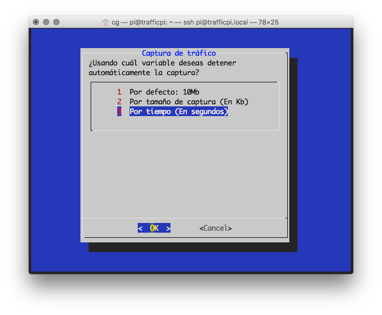
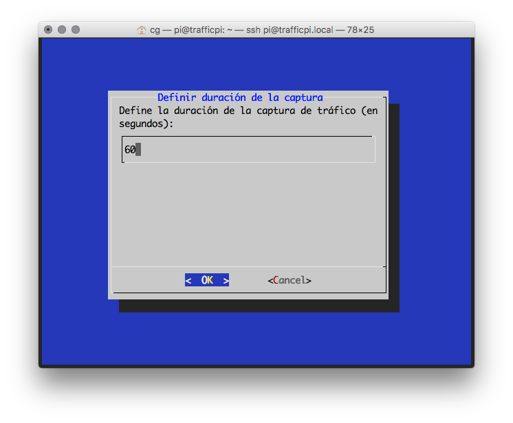
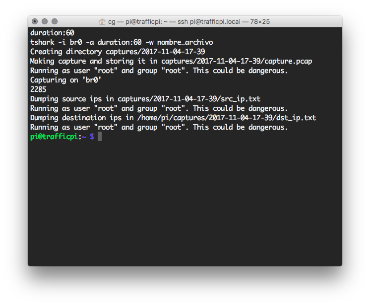

# Captura de tráfico y análisis para detección de compromisos relacionados a Malware


## Premisas iniciales / como se probó la metodología
* Raspberry Pi 3
* Raspbian stretch 9 lite recién instalado en rpi
* wlan0 y eth0 como interfaces de interés


### Configuración de Raspberry pi para realizar capturas de tráfico focalizadas
Se configuró un dispositivo raspberry pi como un punto de acceso inalámbrico, basado en [esta guía]( https://github.com/SurferTim/documentation/blob/6bc583965254fa292a470990c40b145f553f6b34/configuration/wireless/access-point.md#using-the-raspberry-pi-as-an-access-point-to-share-an-internet-connection):
1. ```sudo apt update```
2. ```sudo apt upgrade```
3. ```sudo reboot``` **¡Paso importante!** Pueden haber actualizaciones del kernel que requieren reiniciar para instalarse, si es el caso y no se reinicia el equipo, algunos de los siguientes pasos no funcionarán.
4. ```sudo apt install hostapd bridge-utils dialog```
5. ```sudo systemctl stop hostapd```
6. ```sudo nano /etc/dhcpcd.conf```
  1. agregar ```denyinterfaces wlan0``` y ```denyinterfaces eth0``` al final de archivo
7. ```sudo brctl addbr br0```
8. ```sudo brctl addif br0 eth0```
9. ```sudo nano /etc/network/interfaces```
  1. Agregar al final del archivo lo siguiente:
  ```
  # Bridge setup
  auto br0
  iface br0 inet manual
  bridge_ports eth0 wlan0
  ```
10. ```sudo nano /etc/hostapd/hostapd.conf```
  1. Agregar al archivo o siguiente y modificar ```ssid``` y ```wpa_passphrase``` según aplique:
  ```
  interface=wlan0
  bridge=br0
  #driver=nl80211
  ssid=NameOfNetwork
  hw_mode=g
  channel=7
  wmm_enabled=0
  macaddr_acl=0
  auth_algs=1
  ignore_broadcast_ssid=0
  wpa=2
  wpa_passphrase=AardvarkBadgerHedgehog
  wpa_key_mgmt=WPA-PSK
  wpa_pairwise=TKIP
  rsn_pairwise=CCMP
  ```
11. ```sudo nano /etc/default/hostapd```
  1. Descomentar la línea que comienza con ```#DAEMON_CONF``` para que quede ```DAEMON_CONF="/etc/hostapd/hostapd.conf"```
12. ```sudo reboot```

### Instalación de software de captura de tráfico y configuración:
En esta metodología se propone el uso de tshark por la versatilidad que brinda al capturar paquetes desde la línea de comandos. En esta serie de pasos se compila e instala tshark desde el código fuente y se configura para que se puedan escribir archivos de captura dentro del directorio del usuario pi, así estos archivos son accesibles con más facilidad vía sftp por ejemplo.

La razón por la cual se compila tshark desde el código fuente, es que la versión disponible en el repositorio de raspbian a la fecha de escribir este documento no posee algunas características de interés como la regeneración de archivos transferidos desde la captura de paquetes entre otras características

1. ```sudo apt install tcpdump libgtk-3-dev libpcap-dev libgcrypt20-dev build-essential checkinstall libcurl4-openssl-dev```

2. ```wget https://1.na.dl.wireshark.org/src/wireshark-2.4.2.tar.xz```
3. ```tar xf wireshark-2.4.2.tar.xz```
4. ```cd wireshark-2.4.2```
5. ```./configure --disable-wireshark```. En este caso deshabilitabos wireshark ya que no lo necesitaremos en la Rapsberry Pi ya que será accesada sin interfaz gráfica.
6. ```make```
7. ```sudo checkinstall --fstrans=no```. Aparecerán varios mensajes y confirmaciones, con dejar todo en sus valores por defecto será suficiente
8. ```sudo dpkg -i wireshark_2.4.2-1_armhf.deb```
9. ```sudo ldconfig```
10. ```tshark --version```. Deberíamos tener una respuesta como la siguiente:
```
TShark (Wireshark) 2.4.2 (v2.4.2)
...
```
11. ```sudo -s```
2. ```groupadd -g wireshark``` # Puede dar un error este comando, en este caso el grupo ya existía y se puede continuar sin problemas
13. ```usermod -a -G wireshark pi```
14. ```chgrp wireshark /usr/bin/dumpcap```
15. ```chmod 4750 /usr/bin/dumpcap```
16. ```exit```

### Captura de paquetes y análisis básico
* Se creó un script **start.sh** el cual pide algunos parámetros, realiza la captura de paquetes y procesa la captura para obtener algunos datos preliminares. El script debe ser ejecutado con privilegios root:
  ```
  sudo ./start.sh
  ```
  
  
  

#### Lo que hace el script
* Pide al usuario definir cuándo se detiene el análisis (por tiempo o por tamaño de la captura)
* En caso de ingresar un valor manual se pide dicho valor
* Se obtiene la fecha y hora actuales y se crea el directorio **captures/YYYY-MM-DD/**
* Se realiza la captura de paquetes por la interfaz correspondiente
* Una vez realizada la captura, se buscan los archivos disponibles en /analysis y se ejecutan
* El script escribe todos los archivos en el directorio **captures/YYYY-MM-DD/**

### Extensibilidad de análisis
Se creó el directorio **analysis/** en donde se incluyen algunos archivos .sh, en los cuales se puede ejecutar código bash arbitrario accediendo a todas las variables disponibles en el script **start.sh**, especialmente la variable **$folder** que almacena la ruta absoluta del directorio en donde se almacena la captura en curso, con esta ruta se puede acceder al archivo **capture.pcap** y analizarlo con las herramientas disponibles, se recomienda **tshark** por ser el paquete para el que está optimizado todo el código.

Para crear un nuevo *módulo* de análisis, bastará con crear un archivo .sh en el directorio **analysis/** que manipule toda la información relevante sobre el archivo **$folder/capture.pcap** y escriba en archivos dentro del mismo directorio.

### Disponibilidad de los archivos resultantes
Se sugiere utilizar un cliente FTP para acceder mediante sFTP al dispositivo en **trafficpi.local** o su dirección IP correspondiente con el usuario *pi* y la contraseña *trafficpi* 

## Referencias
* [How to Install the Latest Wireshark from Source on Debian or Ubuntu Linux](https://scottlinux.com/2013/06/07/how-to-install-the-latest-wireshark-from-source-on-debian-or-ubuntu-linux/)
* [tshark man page](https://www.wireshark.org/docs/man-pages/tshark.html)
* [tshark tutorial and filter examples](https://hackertarget.com/tshark-tutorial-and-filter-examples/)
